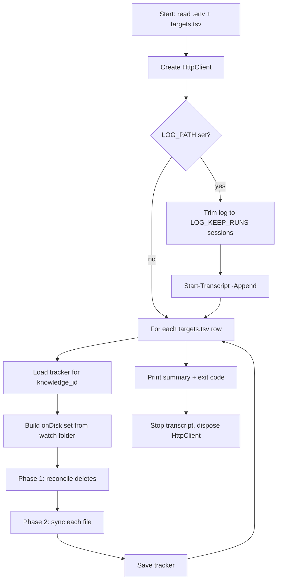
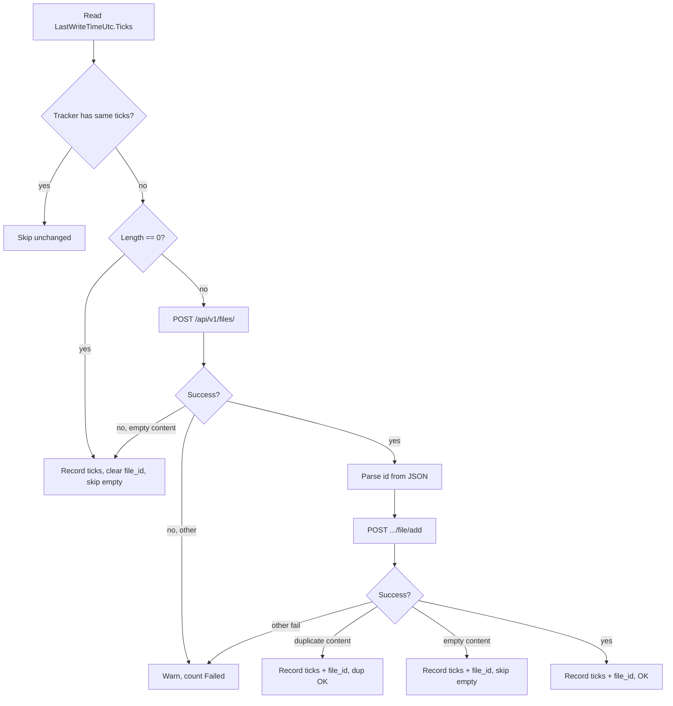

# Sync Obsidian — technical workflow

Syncs local watch folders (for example Obsidian vault paths) into Open WebUI **Knowledge** collections via the REST API. Each run is a **stateful, idempotent batch job**: local tracker files record what was last synced per Knowledge id so reruns avoid redundant uploads unless files change or disappear.

For setup, API key creation, and troubleshooting symptoms, see [README.md](../README.md).

---

## Components

| Piece | Role |
|--------|------|
| `sync-obsidian.bat` | Launches `sync-obsidian.ps1` with `-NoProfile -ExecutionPolicy Bypass`; keeps the window open on failure. |
| `sync-obsidian.ps1` | Core logic: config, HTTP client, per-target scan, tracker I/O, Open WebUI calls. |
| `.env` | Secrets and options (`API_KEY`, `BASE_URL`, extensions, delays, logging). |
| `targets.tsv` | Tab-separated map: `watch_folder` → `knowledge_id` (one Knowledge collection per row). |
| `trackers/uploaded_files_<knowledge_id>.txt` | Per-target sync state (path, mtime ticks, optional `file_id`). |

The script uses **one shared** `System.Net.Http.HttpClient` per run (Bearer auth, configurable timeout). Uploads are **multipart**; attach/remove are **JSON POST**.

---

## Run lifecycle



### Startup

1. **Resolve paths** — Script directory holds `.env`, `targets.tsv`, and relative `LOG_PATH` / tracker paths.
2. **Read `.env`** — `Read-DotEnv` parses `KEY=value` lines; `#` and `REM` lines are ignored; optional quoted values are stripped.
3. **Validate** — `API_KEY` must be set and not the sample placeholder. `targets.tsv` must exist with at least one data row.
4. **Apply config** — `BASE_URL` (trailing slashes stripped), `HTTP_TIMEOUT_SECONDS` (default 600), `UPLOAD_DELAY_MS`, `FILE_EXTENSIONS`, `KNOWLEDGE_REMOVE_DELETE_FILE`, `WARN_EMPTY_CONTENT` / `WARN_EMPTY_ATTACH`, `LOG_PATH`, `LOG_KEEP_RUNS` (default 3).
5. **HTTP** — `New-OpenWebUiHttpClient` sets `Authorization: Bearer <API_KEY>` and `Accept: application/json`.
6. **Logging** — If `LOG_PATH` is set, `Limit-PowerShellTranscriptLog` keeps only the last *N* complete PowerShell transcript blocks, then `Start-Transcript -Append` records host output for this run.

### Shutdown

- `Stop-Transcript` if logging was started.
- Dispose `HttpClient` and handler.
- **Exit code** — `0` if no upload/attach failures and no remove failures; **`1`** if `$totalFail` or `$totalRemoveFail` is greater than zero.

---

## Per-target processing

Each row in `targets.tsv` is processed **independently** with its own tracker file. Rows with empty `watch_folder` / `knowledge_id`, or placeholder `paste-open-webui-knowledge-id-here`, are skipped. Missing watch folders produce a warning and skip that row.

**Tracker path:** `trackers/uploaded_files_<sanitized_knowledge_id>.txt`. On first use, a legacy `uploaded_files_<id>.txt` next to the script is **moved** into `trackers/`.

### Phase 1 — Reconcile local deletes

Before uploading anything, the script compares **tracker keys** to the current **on-disk** file set (recursive `Get-ChildItem`, filtered by extension).

| Tracker path | Still on disk? | Has `file_id`? | Action |
|--------------|----------------|----------------|--------|
| Yes | — | — | No remove step |
| No | Yes | `POST .../file/remove` with `{"file_id":"..."}`; on success, drop path from tracker |
| No | No | Remove tracker row only; warn that Knowledge may still list the document |

`removeUrl` is  
`{BASE_URL}/api/v1/knowledge/{knowledge_id}/file/remove?delete_file={true|false}`  
from `KNOWLEDGE_REMOVE_DELETE_FILE` (default **true** = unlink and delete global file when permitted).

Renames/moves are modeled as **delete old path** + **new path treated as new file** on a later upload pass.

### Phase 2 — Sync each file

For every file under the watch folder whose extension is in `FILE_EXTENSIONS` (default `.md`, `.txt`, `.pdf`, `.html`, `.csv`):



**Change detection** uses **mtime only** (UTC ticks), not file content hashes. Saving a file updates ticks → upload + attach run again. A touch without content change still changes mtime and triggers re-sync.

**0-byte files** are never uploaded. Open WebUI’s storage layer rejects empty bodies (`EMPTY_CONTENT`); the HTTP API often returns a generic “Error uploading file” without that phrase, so the client skips locally and writes tracker state to avoid retry storms.

After all files for the target, **`Save-UploadedState`** rewrites the tracker: sorted paths, only lines for files that **still exist** on disk.

---

## Tracker format

UTF-8 text, one record per line (tab-separated):

```
full_path<TAB>LastWriteTimeUtc_ticks<TAB>open_webui_file_id
```

| Column | Meaning |
|--------|---------|
| Path | Full path as returned by `Get-Item` (case-insensitive dictionary keys). |
| Ticks | .NET `DateTime` ticks for **UTC** last write time at last successful or “skip empty” decision. |
| `file_id` | Optional; set after successful attach (or duplicate/empty attach handling). Required for remote remove on delete. |

**Load behavior:**

- **Path-only legacy lines** — If the file exists, current mtime is recorded as baseline (no immediate upload).
- **Path + ticks, no `file_id`** — Sync and skip-by-mtime work; delete reconciliation cannot call remove API until a successful attach stores an id.

Paths are keyed with **ordinal case-insensitive** comparers so Windows path casing differences do not duplicate rows.

---

## Open WebUI API calls

Base: `{BASE_URL}` (no trailing slash). All calls use the same Bearer token.

### 1. Upload

- **Request:** `POST /api/v1/files/`
- **Body:** `multipart/form-data`, field name `file`, stream from disk.
- **Headers:** `Content-Type` on the part from extension (e.g. `text/markdown` for `.md`, `application/pdf` for `.pdf`). Non-ASCII characters in the **filename** sent in `Content-Disposition` are replaced with `_`; file bytes are read from the real path.
- **Response:** JSON; script reads `id` or `file_id` via `Get-FileIdFromUploadJson`.

### 2. Attach to Knowledge

- **Request:** `POST /api/v1/knowledge/{knowledge_id}/file/add`
- **Body:** `{"file_id":"<uuid>"}`

### 3. Remove from Knowledge

- **Request:** `POST /api/v1/knowledge/{knowledge_id}/file/remove?delete_file=true|false`
- **Body:** `{"file_id":"<uuid>"}`

### Attach failure handling (still “success” for scheduling)

| Response signal | Tracker update | Next run |
|-----------------|----------------|----------|
| `duplicate content detected` | ticks + `file_id` | Skip until mtime changes |
| `content provided is empty` | ticks + `file_id` | Skip until mtime changes (orphan upload may remain in Open WebUI Files UI) |
| Other 4xx/5xx | No update | Retry same file |

Upload empty-content (rare in JSON body) updates **ticks only** and clears `file_id`.

---

## Rate limiting and errors

- **`UPLOAD_DELAY_MS`** — Optional sleep after each upload, attach, or remove attempt to reduce burst load (useful when the server hits “Too many open files”).
- **`Format-OpenWebUiFailureMessage`** — Builds warnings from HTTP status, JSON `detail` / `message`, or transport errors; adds contextual hints (proxy body size, OCR for PDFs, Docker `nofile`, etc.).
- **Per-file failures** do not stop the run; the target’s tracker is still saved with whatever state was updated before failures.

---

## Summary counters

End of run prints:

| Counter | Meaning |
|---------|---------|
| New uploads | First-time successful upload+attach for a path |
| Re-uploaded (changed) | Path was in tracker but mtime differed |
| Skipped (unchanged) | Tracker ticks match current mtime |
| Skipped (empty content until changed) | 0-byte skip or empty upload/attach handling |
| Dup attach OK | Attach returned duplicate content |
| Removed (remote) | Local delete + successful remove API |
| Remove failed | Remove API failed; tracker row kept |
| Tracker pruned (no file_id) | Local delete, no `file_id` to remove remotely |
| Failed | Upload/attach errors (not empty/duplicate handled paths) |

---

## Design notes

- **One tracker per Knowledge id** — Same filename in two watch folders can map to two collections without collision.
- **No content hashing** — Simpler and fast; relies on Obsidian/editor saves updating mtime.
- **HttpClient over curl** — Reliable opens for Unicode paths on Windows.
- **Transcript log rotation** — `LOG_KEEP_RUNS` trims by matching PowerShell transcript start/end banners so `output.log` stays bounded while keeping full session context per retained run.

---

## File map (implementation)

| File | Functions / responsibility |
|------|---------------------------|
| `sync-obsidian.ps1` | `Read-DotEnv`, `Load/Save-UploadedState`, `Limit-PowerShellTranscriptLog`, `Invoke-OpenWebUiFileUpload`, `Invoke-OpenWebUiKnowledgeFileAdd/Remove`, main loop |
| `.env.sample` | Documented environment variables |
| `targets.sample.tsv` | Column layout example (not read at runtime) |
